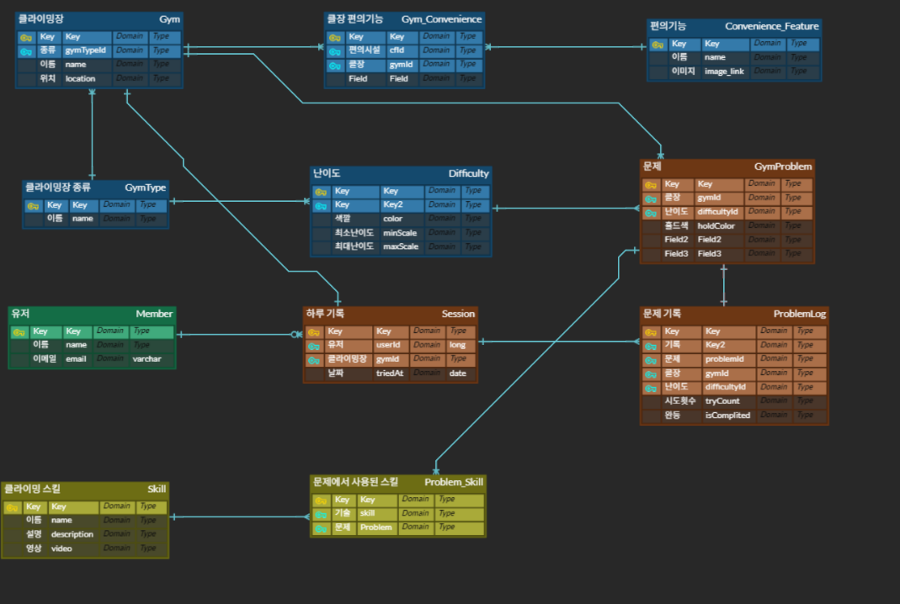

# 📅 [2025-09-18] Daily Log - 토이 프로젝트

# 🧗 클라이밍 문제 기록 서비스 기획서

## 1. 서비스 개요

- 서비스 목적: 클라이머가 암장에서 시도한 문제를 손쉽게 기록하고, 자신의 성취 및 통계를 확인할 수 있도록 지원

- 핵심 가치

    1. 유저 개인의 성장 추적 (성공률, 시도 기록, 영상 아카이브)

    2. 암장 문제별 통계 제공 (인기 문제, 난이도별 성공률)

    3. 클라이머 간 비교/공유 기능 확장 가능

## 2. 주요 기능

### 2.1. 세션 관리

- 유저는 암장에 방문해서 클라이밍 기록을 세션(Session)을 통해 남긴다.
- 날짜, 그날의 기록을 남긴다.

### 2.2. 문제 선택 & 기록

- 앱에서 암장별 현재 활성화된 문제(GymProblem) 리스트 제공 (향후 AI 이용해서 문제 추출 및 검색)
- 유저는 문제 선택 후 시도 기록(ProblemLog) 추가:
    - 시도 횟수
    - 성공 여부
    - 영상 업로드 (optional)
    - 사용한 스킬 태그 (예: 크림프, 다이나믹) [추후 자동으로 추가?]

### 2.3. 통계 & 피드백

- 개인 통계
    - 세션별 성공률
    - 난이도별 성취도
    - 시도 대비 성공 그래프
- 문제 통계
    - 암장별 인기 문제
    - 난이도별 평균 성공률
- 스킬 분석
    - 자주 사용하는 스킬
    - 실패 문제에서 부족한 스킬 패턴 도출 (향후 AI 피드백 가능)

### 2.4. 커뮤니티 확장 (차후 단계)

- 친구/팀 기능: 다른 유저의 문제 성공 기록 확인
- 특정 문제에 대한 영상 비교/피드백
- 암장별 리더보드 (Top Try-Hard, One-shot King 등 랭킹)

## 3. DB 기반 서비스 흐름

1. 운영자(또는 암장)
    - 월별로 암장 문제(GymProblem) 등록 (난이도, 색상, 만료일 포함)
2. 유저(Member)
    - 암장 방문 → 세션(Session) 생성
    - 문제 선택(GymProblem) 후 시도 기록(ProblemLog) 입력
    - 필요 시 영상/스킬 태그 추가

3. 분석 엔진
    - DB 내 ProblemLog 집계 → 개인/문제/암장 단위 통계 생성
    - 스킬 사용 패턴/부족 패턴 도출

4. 확장 포인트
    1. AI 피드백
        - 업로드된 영상 + 실패 기록 기반으로 자동 분석
        - "크림프에서 자주 미끄러짐 → 손가락 힘 훈련 추천"

    2. AI 문제 추출
        - 암장 문제 DB 자동 연동 (운영자 관리 툴 제공)
        - 암장별 이용자 데이터 리포트 제공

    3. 게임화 요소
        - 문제 성공 시 배지 지급 (예: 난이도 완등 인증)
        - 한 달 챌린지 기능 (예: 5.11A 이상 10문제 성공하기)

5. 기대 효과

- 유저 입장: 단순 메모 → 체계적 기록 → 성취감 & 성장 추적
- 암장 입장: 문제별 인기/난이도 통계 확보 → 문제 세팅 효율화
- 서비스 확장: 커뮤니티 & AI 분석 접목으로 차별화된 플랫폼 성장

6. ERD 초기설계
   